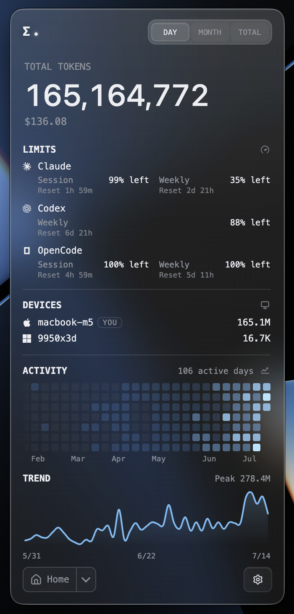
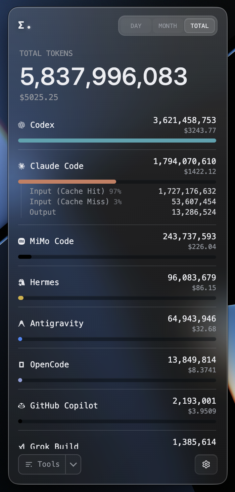

<p align="right">
   <a href="./README.md">EN</a> | <a href="./README.zh-CN.md">简</a> | <a href="./README.zh-TW.md">繁</a> | <a href="./README.ko.md">KO</a> | <strong>JA</strong>
</p>
<div align="center">
    
    <h1>Token Monitor</h1>
</div>

<p align="center">
    <em>すべての AI コーディングツールのリアルタイム使用量を一画面で、複数デバイス間で同期。</em>
</p>

<p align="center">
    <a href="https://github.com/wwjhw2005/token-monitor/releases"></a>
    <a href="https://github.com/wwjhw2005/token-monitor/releases"></a>
    
    
    
    <a href="https://discord.gg/HmdNVVvw5P"></a>
    <a href="LICENSE"></a>
</p>

<div align="center">
    
</div>

## Token Monitor とは

Claude Code、Codex、Cursor、GitHub Copilot など 25+ 種類の AI コーディングツールのリアルタイムトークン使用量と AI ツール制限を表示するデスクトップウィジェットです。複数デバイス間のリアルタイム同期、使用履歴トレンド、ツール・デバイス・モデル・セッション・プロジェクト別の内訳表示に対応しています。

## 対応ツール

Token Monitor は **トークン使用量**、**アカウント制限**、**セッション詳細** を個別にサポートします。

| Logo | ツール | データパス | トークン使用量 | AI ツール制限 | セッション詳細 |
|:---:|------|-----------|:---:|:---:|:---:|
|  | Claude Code | `~/.claude/projects/`, `~/.claude/transcripts/` | ✅ | ✅ | ✅ |
|  | Codex | `~/.codex/sessions/` | ✅ | ✅ | ✅ |
|  | OpenCode | `~/.local/share/opencode/` | ✅ | ✅ | ✅ |
|  | Hermes Agent | `$HERMES_HOME/state.db` または `~/.hermes/state.db` | ✅ | — | — |
|  | OpenClaw | `~/.openclaw/agents/` | ✅ | — | — |
|  | Cursor | `~/.config/tokscale/cursor-cache/`（Cursor 同期で更新） | ✅ | ✅ | — |
|  | Antigravity | `~/.config/tokscale/antigravity-cache/`（Antigravity 同期で更新） | ✅ | ✅ | — |
|  | Cline | VS Code globalStorage tasks (`.../saoudrizwan.claude-dev/tasks/`) | ✅ | — | — |
|  | Kimi CLI / Kimi Code | `~/.kimi/sessions/`, `~/.kimi-code/sessions/` (`KIMI_CODE_HOME`); Kimi Code API キー（Kimi API で Kimi Code クォータ取得） | ✅ | ✅ | — |
|  | Qwen CLI | `~/.qwen/projects/` | ✅ | — | — |
|  | Grok Build | `$GROK_HOME/sessions/` または `~/.grok/sessions/` | ✅ | ✅ | — |
|  | GitHub Copilot | VS Code `workspaceStorage/*/chatSessions/`、`~/.copilot/otel/` | ✅ | ✅ | — |
|  | Pi | `~/.pi/agent/sessions/`, `~/.omp/agent/sessions/` (Oh My Pi) | ✅ | — | — |
|  | Zed | `~/.local/share/zed/threads/threads.db` | ✅ | — | — |
|  | Kilo Code | VS Code globalStorage tasks (`.../kilocode.kilo-code/tasks/`) — Linux およびリモート/WSL のみ | ✅ | — | — |
|  | MiMo Code | `~/.local/share/mimocode/mimocode.db` | ✅ | ✅ | — |
|  | ZCode / GLM | `~/.zcode/projects/`; Z.ai API キー（Z.ai API で GLM 個人/チーム Coding Plan クォータ取得） | ✅ | ✅ | — |
|  | Kiro | `~/.kiro/sessions/cli/`, Kiro IDE globalStorage および `kiro-cli` DB | ✅ | ✅ | — |
|  | CodeBuddy | `~/.codebuddy/projects/` + IDE / VS Code 拡張ログ | ✅ | — | — |
|  | WorkBuddy | `~/.workbuddy/projects/`, `~/.workbuddy/workbuddy.db` | ✅ | — | — |
|  | Proma | `~/.proma/agent-sessions/*.jsonl` | ✅ | — | — |
|  | DeepSeek | DeepSeek API キー（DeepSeek API で残高取得） | — | ✅ | — |
|  | Minimax | Minimax API キー（Minimax API で Token Plan クォータ取得） | — | ✅ | — |
|  | Volcengine | Ark API key または Volcengine AK/SK（Volcengine API で Ark Coding Plan クォータ取得） | — | ✅ | — |
|  | Qoder | Qoder dashboard cookie（Qoder usage API で big-model credits 取得） | — | ✅ | — |
|  | Ollama | Ollama Cloud cookie（ollama.com/settings で session/weekly 使用量を取得） | — | ✅ | — |
|  | WeCode | WeCode ユーザー名（copilot.weibo.com API でクォータ取得） | — | ✅ | — |

## ショーケース

<table>
<tr>
<td width="290" align="center"><br><sub>カスタマイズ可能なダッシュボード — 表示するモジュールと順序を選択</sub></td>
<td width="290" align="center"><br><sub>複数アカウントを並べて表示、Codex はローカルアカウントをワンクリック切り替え</sub></td>
<td width="290" align="center"><br><sub>任意のツールをクリックして入力／出力とキャッシュヒットの内訳を展開</sub></td>
</tr>
<tr>
<td width="290" align="center"><br><sub>単一セッションを開いて、プロンプトごとにトークンと使用ツールを分解</sub></td>
<td width="290" align="center"><br><sub>ツール横断で各モデルの使用量とコストを集計</sub></td>
<td width="290" align="center"><br><sub>各デバイスの使用量・コスト・同期状態、展開でマシン別詳細</sub></td>
</tr>
</table>

<table>
<tr>
<td width="435" align="center"><br><sub>全デバイス横断の 1 年分アクティビティヒートマップと連続日数</sub></td>
<td width="435" align="center"><br><sub>1 年分の日次トレンド、ツール／モデル別に積み上げ、K 線対応</sub></td>
</tr>
</table>

## Token Monitor を使う理由

多くの使用量モニターは、実行しているマシン上でのみ役立ちます。Token Monitor はマルチデバイス作業のために設計されています。各デバイスがローカルログを監視し、hub にサマリーを送信すると、接続されたすべてのウィジェットがトークンの変化をほぼリアルタイムで確認できます。

## 機能

### 使用量の追跡

- **リアルタイムトークン追跡** — Claude Code、Codex、Cursor、GitHub Copilot、Antigravity、OpenCode など 20+ 種類の AI ツール、各ターンから数秒以内に UI 更新（全リストは上の表を参照）
- **セッション別詳細** — Claude Code、Codex、OpenCode セッションでプロンプトごとのトークン、各応答のトークン分割・使用ツールまで展開（ローカル transcript/DB を必要時のみ読み込み、同期しない）
- **キャッシュヒット統計** — ツール・モデルをクリックすると入力トークン（キャッシュ hit/miss）、出力トークン、ヒット率の詳細
- **コストと通貨** — トークン数とともにコストを表示。USD、TWD、HKD、CNY に対応し、為替レートは毎日自動更新、設定で手動上書き可能
- **WSL 使用量 (Windows)** — 実行中の WSL ディストリビューションにあるファイルベースの使用量を約 5 分ごとに自動検出して合算。OpenCode や Hermes など SQLite ベースのツールでは、[WSL 内のヘッドレスエージェント](docs/wsl-sqlite-setup.md)が必要になる場合があります

### 制限・トレンド・エクスポート

- **AI ツール制限検出** — Claude Code、Codex、Cursor、GLM、Kimi など 15+ プロバイダーの session/weekly/billing/credits、DeepSeek プリペイド残高・本日/今月の使用額
- **複数アカウントと Codex 切り替え** — 1 つのプロバイダーで複数アカウントを追跡し、それぞれの制限を表示。追跡済みの Codex アカウントは、再認証なしでローカルアカウントとしてワンクリック切り替え可能
- **削除されたセッション使用量を保持** — 多くのツールは古いセッションを削除します（Claude Code はデフォルトで 30 日後にトランスクリプトを削除）。有効にすると、Token Monitor は観測済みの日別ツール/モデル使用量をローカルにアーカイブし、元ファイルが消えてもヒートマップとトレンドを維持します（下記 [セッションデータの保持期間](#セッションデータの保持期間) を参照）
- **使用トレンド & ダッシュボード** — ホーム画面のアクティビティヒートマップ・トレンドチャート、連続日数・全デバイス横断のツール/モデル別累積使用（棒・K 線）専用ダッシュボードウィンドウ
- **ステータスビュー**（任意） — Claude、OpenAI、Cursor、DeepSeek のステータスページを手動/定期確認
- **データエクスポート** — ツール非依存の CSV + JSON で手動エクスポートまたはフォルダへの自動書き込み（スプレッドシート、Obsidian、Grafana、スクリプト用）；[docs/export.md](docs/export.md) を参照

### マルチデバイスとデプロイ

- **マルチデバイスリアルタイム同期** — Server-Sent Events。1 台の変更が数秒以内に他のデバイスに反映
- **ローカルファースト** — 単一デバイスではサーバー不要
- **セルフホスト同期** — ウィジェット内 hub、Node CLI hub、Cloudflare Worker
- **iOS ウィジェット** — Worker hub + Widgy、Scriptable
- **プライバシー優先** — プロンプト、応答、ソースコード、ファイル内容はすべてデバイス内に保持

### インターフェースと表示

- **内訳ビュー** — ツール、デバイス、モデル、セッション、プロジェクト、アカウント制限別
- **メニューバー (macOS) / システムトレイ (Windows)** — コスト、トークン、または残量が最も少ないプロバイダー制限 % をアイコン横に表示
- **フローティングバブル** — ドラッグ可能なミニウィンドウ、クリック/ホバープレビュー
- **外観** — テーマ（ライトモード含む）、ツール別カラー、ガラス透明度・ぼかし、透明ウィンドウ
- **ツールリストのカスタマイズ** — 追跡は維持したまま非表示、ピン留め、順序変更
- **グローバルショートカット** — どこからでもウィンドウの表示/非表示
- **Discord Rich Presence** — 本日のトークン・コスト・主要クライアント（オプトイン）

## インストール

[GitHub Releases](https://github.com/wwjhw2005/token-monitor/releases) からダウンロードできます。

- **macOS (Apple Silicon)** — `.dmg`、署名および notarize 済み
- **macOS (Intel)** — x64 `.dmg`、署名および notarize 済み
- **Windows 10/11** — インストーラー版とポータブル版の `.exe`、[署名済み](docs/code-signing.md)
- **Linux x64** — `.AppImage`

パッケージ版は GitHub Releases を自動確認します。新しいバージョンがある場合は画面に更新インジケーターが表示され、対応プラットフォームでは 設定 → 一般 からもインストールできます。

### 初回起動

ローカルモードがデフォルトです。アプリを起動すると、このデバイスの追跡を開始します。hub、agent、設定は不要です。

## マルチデバイス同期

すべてのデバイス（および headless agent）が接続する **hub を 1 つ** 選びます。各デバイスでウィジェットを開き、**設定 → マルチデバイス同期** でモードを選択します。ウィジェットがこのデバイスの使用量を自動的にアップロードします。ウィジェットがないマシンでのみ `npm run agent` を実行してください。

#### オプション A — ウィジェットから hub をホスト（最も簡単、CLI 不要）

常時起動のマシンで **設定 → マルチデバイス同期 → このデバイスでHubをホスト** を選択します。ウィジェットが secret を生成し、LAN URL（Tailscale/ZeroTier 含む）を表示します。他のデバイスでは **Hubに接続** に URL と secret を貼り付けます。

Token Monitor が実行中の間のみ hub が動作します。アプリを終了すると（ウィンドウを閉じるだけではなく）hub が停止し、接続されたデバイスが切断されます。

#### オプション B — Node hub をセルフホスト（常時 headless マシン）

```bash
# 常時起動のマシンで
cp .env.example .env
# TOKEN_MONITOR_SECRET を非公開の値に設定してから:
npm run hub
```

#### オプション C — Cloudflare Worker hub（ネットワーク間、iPhone 含む）

[](https://deploy.workers.cloudflare.com/?url=https://github.com/wwjhw2005/token-monitor/tree/main/worker)

ワンクリックデプロイでは `TOKEN_MONITOR_SECRET` の入力を求められます。手動デプロイ:

```bash
cd worker
npm install
npx wrangler login
npx wrangler secret put TOKEN_MONITOR_SECRET
npx wrangler deploy
```

デプロイ URL を各デバイスの **設定 → マルチデバイス同期** に貼り付けます。iOS ウィジェットは [worker/README.md](worker/README.md)、HTTP API は [docs/API.md](docs/API.md) を参照してください。

## アプリデータ

アプリの状態は OS のユーザーデータディレクトリに保存されます。アプリと一緒にそのフォルダを削除すると完全にアンインストールできます。

| プラットフォーム | パス |
|--------|------|
| macOS | `~/Library/Application Support/Token Monitor/` |
| Windows | `%APPDATA%/Token Monitor/` |
| Linux | `~/.config/Token Monitor/` |

## ソースからビルド

自分でインストーラーをビルドする場合は、**対象 OS** 上で Node.js 22.13+ を使用してください（electron-builder は macOS `.dmg` と Windows `.exe` のクロスビルド不可）。

```bash
npm install
npm run dist:mac     # macOS arm64 .dmg           → dist/
npm run dist:mac:x64 # macOS Intel x64 .dmg       → dist/
npm run dist:win     # Windows x64 installer .exe → dist/
npm run dist:linux   # Linux x64 AppImage         → dist/
npm run pack         # インストーラーなしのアプリディレクトリ（ローカルテスト用）
```

出力は `dist/` に生成されます。Windows と Linux は対象 OS 上で上記の対応する `dist:*` スクリプトを使います。macOS リリース版をパッケージングするには、この Mac に Developer ID Application の署名 ID が必要です。ローカル開発または未対応プラットフォームでは `npm start` を使ってください。

## 動作の仕組み

```text
モード A — ローカル（デフォルト、設定不要）
    ウィジェット (Electron) ──▶ tokscale ──▶ ~/.claude, ~/.codex, $HERMES_HOME

モード B — 同期（オプトイン、マルチデバイス）
    デバイス A agent ──▶
    デバイス B agent ──▶  hub  ──▶  任意のデバイスのウィジェット
    デバイス C agent ──▶
```

ウィジェットは **設定 → マルチデバイス同期** に応じてローカル/同期を選択します。hub は `npm run hub`、Cloudflare Worker、またはウィジェット内 Host モードで実行できます。同期モードでは hub が SSE で集計統計をプッシュし、1 台の変更が数秒以内に他のデバイスに反映されます。

## セッションデータの保持期間

**削除されたセッション使用量を保持**（設定 → 収集）を有効にすると、Token Monitor は観測済みの日別ツール/モデル使用量を期限なしでローカルにアーカイブします。元のツールが後からセッションを削除しても、ヒートマップとトレンドは影響を受けません。

<details>
<summary><strong>詳細: 元ツール自体の保持期間を延長する</strong></summary>

<br>

ヒートマップと同期データは 370 日のローリング期間を使用します（それより古い観測データは将来の表示用にローカルへ残ります）。**Claude Code はデフォルトで 30 日分のトランスクリプトしか保持しません**（`cleanupPeriodDays`）。アーカイブが働き始める前にローリング 1 年分を保つには、期限が過ぎる前に `~/.claude/settings.json` で延長してください：

```json
{
  "cleanupPeriodDays": 370
}
```

値を大きくすればより多く残せますが、その分トランスクリプトがディスク上に残り続けます。他のツールのデフォルト値と設定ファイルのパスは、tokscale の [Session Data Retention](https://github.com/junhoyeo/tokscale#session-data-retention) の表を参照してください。

このアーカイブは Token Monitor が既に観測した日のみを対象とします。追跡を開始する前に削除されたデータは復元できません。

</details>

## 設定

Token Monitor の設定は 2 か所にあります。日常利用に必要なのは前者だけです。

- **ウィジェット (GUI)** — 右下の `⚙` ボタンで開きます。セクションは順に：一般（言語、ログイン時に起動、アップデート）、メイン画面（ホームモジュールと表示通貨）、ウィンドウ（ウィンドウ動作、トレイモード、フローティングバブル、ショートカット）、外観（テーマとツール別カラー）、収集（追跡ツール、収集間隔、削除されたセッション使用量を保持、データエクスポート）、AI ツール制限、アカウント（プロバイダー別の認証情報）、マルチデバイス同期。タイトルバーの `⇧` ボタンでウィンドウ動作を切り替えます。
- **Headless agent と hub** — UI なし。プロジェクトルートの `.env`（`.env.example` をコピー）で設定します。優先順位は CLI フラグ → 環境変数 → 既定値。

すべての設定と環境変数の詳細は [設定リファレンス](docs/configuration.md) を参照してください。

## プライバシー

Token Monitor は使用ログをローカルで処理し、プロジェクトのメンテナーに分析データやテレメトリを送信しません。ネットワークアクセスは、文書化された機能またはユーザーが有効にした機能に限られます。アップデート、プロバイダー連携、Discord Rich Presence、任意のマルチデバイス同期で使用されるデータについては、[プライバシーポリシー](docs/privacy.md)を参照してください。

## Star 履歴

<a href="https://www.star-history.com/?repos=wwjhw2005%2Ftoken-monitor&type=date&legend=top-left">
 <picture>
   <source media="(prefers-color-scheme: dark)" srcset="https://api.star-history.com/chart?repos=wwjhw2005/token-monitor&type=date&theme=dark&legend=top-left&sealed_token=VEcaPQSNlH8coYjuILJy7eT6t-pGJrGDEjOAjVwP8WGwNBOeNXoLTcz-KVBaZ2Y8eSqG1tLEpWGF3-5eMvVhW5G8n1ckdYI_uMZ6UCBE7b_eANd6we__7g7yc4ShXemuWfi-8SRcxgJNLK12VZGgBIccY1ceI3T3xm7jBM1TJjTVQFWJ0MmX2e-7QBp9" />
   <source media="(prefers-color-scheme: light)" srcset="https://api.star-history.com/chart?repos=wwjhw2005/token-monitor&type=date&legend=top-left&sealed_token=VEcaPQSNlH8coYjuILJy7eT6t-pGJrGDEjOAjVwP8WGwNBOeNXoLTcz-KVBaZ2Y8eSqG1tLEpWGF3-5eMvVhW5G8n1ckdYI_uMZ6UCBE7b_eANd6we__7g7yc4ShXemuWfi-8SRcxgJNLK12VZGgBIccY1ceI3T3xm7jBM1TJjTVQFWJ0MmX2e-7QBp9" />
   
 </picture>
</a>

## コントリビュート

Issue や PR を歓迎します。プロジェクトの規約、アーキテクチャノート、コマンドリファレンスは [AGENTS.md](AGENTS.md) にあります — コーディングエージェント向けに書かれていますが、コントリビューターガイドとしても使えます。

## 謝辞

- [tokscale](https://github.com/junhoyeo/tokscale) — ログ解析とトークン集計
- [CodexBar](https://github.com/steipete/CodexBar) — AI ツール制限の調査
- **[コード署名ポリシー](docs/code-signing.md)：** 無償のコード署名は [SignPath.io](https://signpath.io/) が提供し、証明書は [SignPath Foundation](https://signpath.org/) が提供します。

## ライセンス

[MIT](LICENSE) © [@Javis](https://github.com/Javis603)
