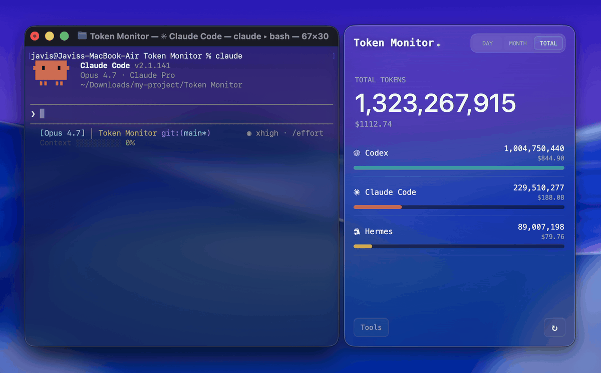
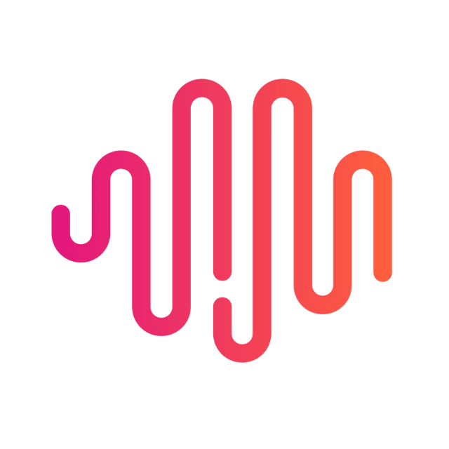
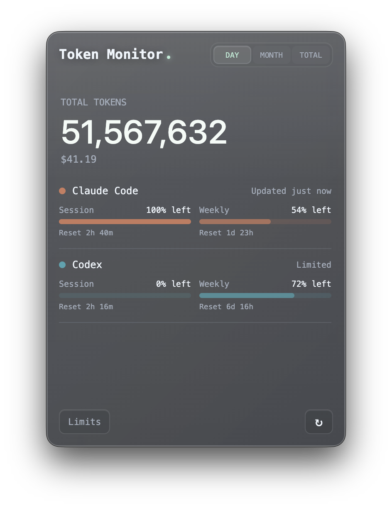
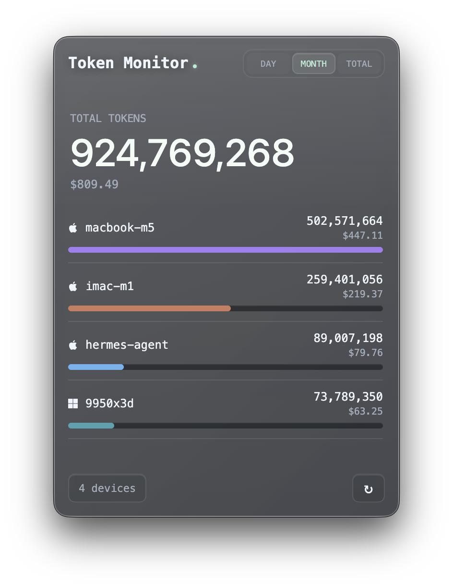
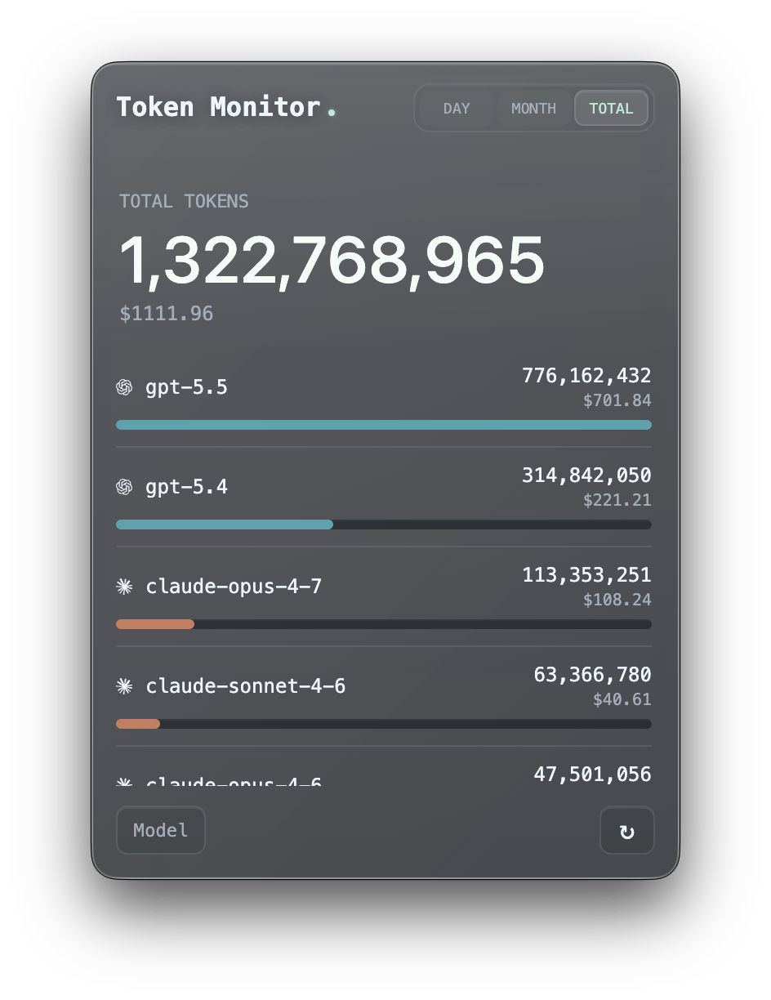
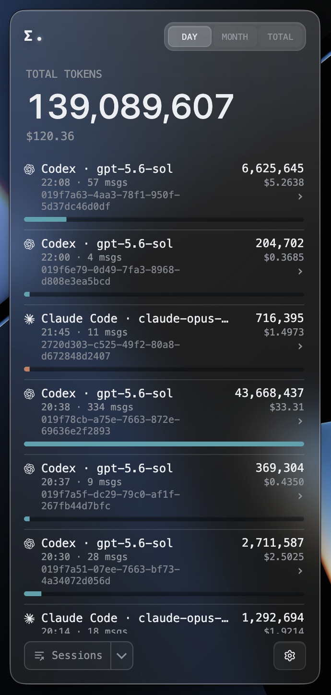
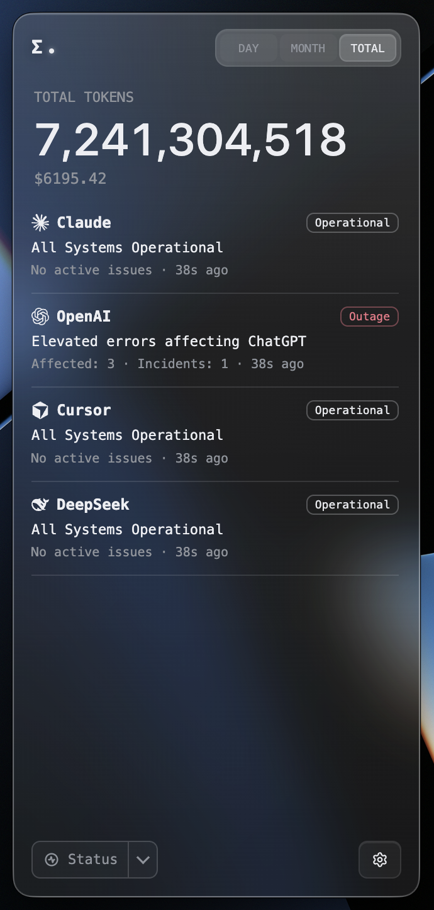
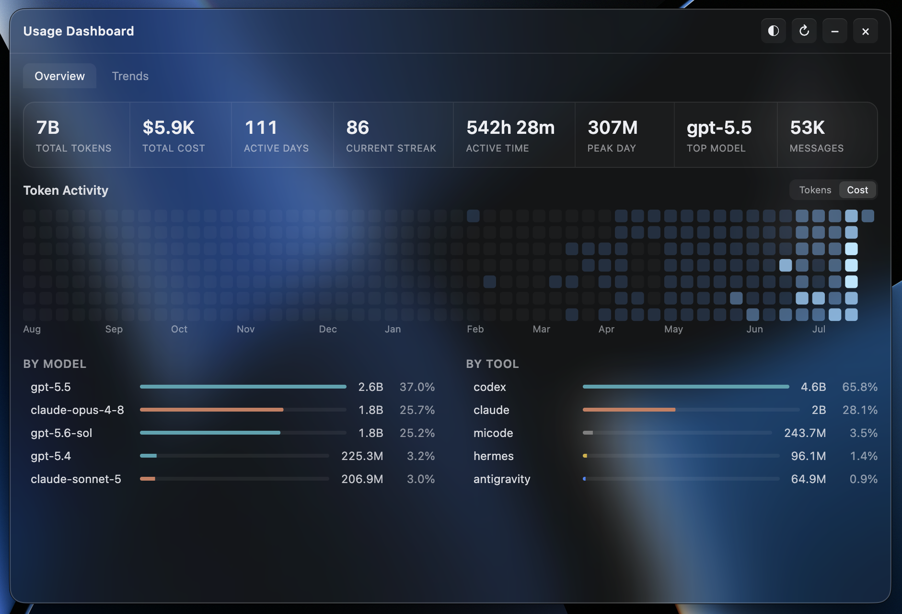
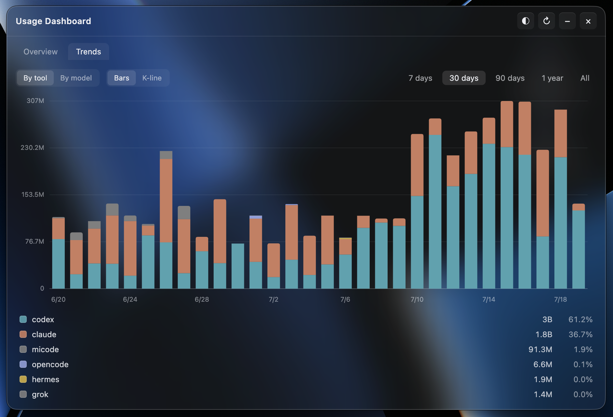

<p align="right">
   <a href="./README.md">EN</a> | <a href="./README.zh-CN.md">简</a> | <a href="./README.zh-TW.md">繁</a> | <strong>KO</strong> | <a href="./README.ja.md">JA</a>
</p>
<div align="center">
    
    <h1>Token Monitor</h1>
</div>

<p align="center">
    <em>모든 AI 코딩 도구의 실시간 사용량을 한 화면에서, 여러 기기에 동기화.</em>
</p>

<p align="center">
    <a href="https://github.com/Javis603/token-monitor/releases"></a>
    <a href="https://github.com/Javis603/token-monitor/releases"></a>
    
    
    
    <a href="https://discord.gg/HmdNVVvw5P"></a>
    <a href="LICENSE"></a>
</p>

<div align="center">
    
</div>

## Token Monitor란?

Claude Code, Codex, Hermes Agent, OpenCode, OpenClaw, Cursor, Antigravity, Cline 등 다양한 AI 코딩 도구의 실시간 토큰 사용량과 AI 도구 한도를 보여 주는 데스크톱 위젯입니다. 여러 기기 간 실시간 동기화, 사용 추세 기록, 도구·기기·모델·세션별 분류 보기를 지원합니다.

## 지원 도구

Token Monitor는 **토큰 사용량**, **계정 한도**, **세션 상세**를 각각 지원합니다.

| Logo | 도구 | 데이터 경로 | 토큰 사용량 | AI 도구 한도 | 세션 상세 |
|:---:|------|-----------|:---:|:---:|:---:|
|  | Claude Code | `~/.claude/projects/`, `~/.claude/transcripts/` | ✅ | ✅ | ✅ |
|  | Codex | `~/.codex/sessions/` | ✅ | ✅ | ✅ |
|  | OpenCode | `~/.local/share/opencode/` | ✅ | ✅ | ✅ |
|  | Hermes Agent | `$HERMES_HOME/state.db` 또는 `~/.hermes/state.db` | ✅ | — | — |
|  | OpenClaw | `~/.openclaw/agents/` | ✅ | — | — |
|  | Cursor | `~/.config/tokscale/cursor-cache/` (Cursor 동기화로 갱신) | ✅ | ✅ | — |
|  | Antigravity | `~/.config/tokscale/antigravity-cache/` (Antigravity 동기화로 갱신) | ✅ | ✅ | — |
|  | Cline | VS Code globalStorage tasks (`.../saoudrizwan.claude-dev/tasks/`) | ✅ | — | — |
|  | Kimi CLI / Kimi Code | `~/.kimi/sessions/`, `~/.kimi-code/sessions/` (`KIMI_CODE_HOME`); Kimi Code API 키 (Kimi API로 Kimi Code 할당량 조회) | ✅ | ✅ | — |
|  | Qwen CLI | `~/.qwen/projects/` | ✅ | — | — |
|  | Grok Build | `$GROK_HOME/sessions/` 또는 `~/.grok/sessions/` | ✅ | ✅ | — |
|  | GitHub Copilot | VS Code `workspaceStorage/*/chatSessions/`, `~/.copilot/otel/` | ✅ | ✅ | — |
|  | Pi | `~/.pi/agent/sessions/`, `~/.omp/agent/sessions/` (Oh My Pi) | ✅ | — | — |
|  | Zed | `~/.local/share/zed/threads/threads.db` | ✅ | — | — |
|  | Kilo Code | VS Code globalStorage tasks (`.../kilocode.kilo-code/tasks/`) — Linux 및 원격/WSL만 | ✅ | — | — |
|  | MiMo Code | `~/.local/share/mimocode/mimocode.db` | ✅ | ✅ | — |
|  | ZCode / GLM | `~/.zcode/projects/`; Z.ai API 키 (Z.ai API로 GLM 개인/팀 Coding Plan 할당량 조회) | ✅ | ✅ | — |
|  | Kiro | `~/.kiro/sessions/cli/`, Kiro IDE globalStorage 및 `kiro-cli` DB | ✅ | ✅ | — |
|  | CodeBuddy | `~/.codebuddy/projects/` + IDE / VS Code 확장 로그 | ✅ | — | — |
|  | WorkBuddy | `~/.workbuddy/projects/`, `~/.workbuddy/workbuddy.db` | ✅ | — | — |
|  | Proma | `~/.proma/agent-sessions/*.jsonl` | ✅ | — | — |
|  | DeepSeek | DeepSeek API 키 (DeepSeek API로 잔액 조회) | — | ✅ | — |
|  | Minimax | Minimax API 키 (Minimax API로 Token Plan 할당량 조회) | — | ✅ | — |
|  | Volcengine | Ark API key 또는 Volcengine AK/SK (Volcengine API로 Ark Coding Plan 할당량 조회) | — | ✅ | — |
|  | Qoder | Qoder dashboard cookie (Qoder usage API로 big-model credits 조회) | — | ✅ | — |
|  | Ollama | Ollama Cloud cookie (ollama.com/settings에서 session/weekly 사용량 조회) | — | ✅ | — |

## Token Monitor를 쓰는 이유

대부분의 사용량 모니터는 실행 중인 그 기기에서만 유용합니다. Token Monitor는 멀티 디바이스 작업을 위해 만들어졌습니다. 각 기기가 로컬 로그를 감시하고 hub로 요약을 보내면, 연결된 모든 위젯이 토큰 변화를 거의 실시간으로 볼 수 있습니다.

## 기능

- **실시간 토큰 추적** — Claude Code, Codex, Hermes Agent, OpenCode, OpenClaw, Cursor, Antigravity, Cline, Kimi, Qwen, Grok Build, GitHub Copilot, Pi, Zed, Kilo Code, MiMo Code, ZCode, Kiro, CodeBuddy, WorkBuddy, Proma (턴당 수 초 내 UI 갱신)
- **WSL 사용량 (Windows)** — 실행 중인 WSL 배포판 안 AI 도구 사용량을 자동 감지해 합산 (약 5분마다 주기 스캔)
- **멀티 디바이스 실시간 동기화** — Server-Sent Events
- **분류 보기** — 도구, 기기, 모델, 세션, 계정 한도별
- **세션별 상세** — Claude Code, Codex, OpenCode 세션에서 프롬프트별 토큰, 응답별 토큰 분할·사용 도구까지 확장 (로컬 transcript/DB를 필요할 때만 읽으며 동기화하지 않음)
- **캐시 히트 통계** — 도구·모델 클릭 시 입력 토큰(캐시 hit/miss), 출력 토큰, 히트율 상세
- **비용 분류** — 토큰 수와 함께 비용 표시
- **원하는 통화로 비용 표시** — USD, TWD, HKD, CNY; 환율은 매일 자동 갱신, 설정에서 수동 덮어쓰기 가능
- **사용 추세 & 대시보드** — 홈 화면 활동 히트맵·추세 차트, 연속 일수·기기 전체 도구/모델별 누적 사용(막대·K선) 전용 대시보드 창
- **데이터 내보내기** — 도구 무관 CSV + JSON으로 수동 내보내기 또는 폴더 자동 기록 (스프레드시트, Obsidian, Grafana, 스크립트용); [docs/export.md](docs/export.md) 참고
- **AI 도구 한도 감지** — Claude Code, Codex, Cursor, Antigravity, OpenCode, Grok, Minimax, MiMo, GitHub Copilot, Kiro, GLM, Volcengine, Qoder, Kimi, Ollama의 공급자별 session/weekly/billing/credits, DeepSeek 선불 잔액·오늘/이번 달 사용액. 추적 중인 Codex 계정을 재인증 없이 로컬 Codex 계정으로 전환할 수 있습니다
- **상태 보기** (선택) — Claude, OpenAI, Cursor, DeepSeek 상태 페이지 수동/주기 확인
- **도구 목록 커스터마이즈** — 추적은 유지한 채 숨기기, 고정, 순서 변경
- **외관** — 테마(라이트 포함), 도구별 색, 글래스 투명도·블러, 투명 창
- **메뉴 막대(macOS) / 시스템 트레이(Windows)** — 비용, 토큰, Claude/Codex/Cursor/Antigravity/OpenCode/Grok/Minimax/MiMo/GitHub Copilot/Kiro/GLM/Volcengine/Qoder/Kimi/Ollama 한도 % 등
- **플로팅 버블** — 드래그 가능한 미니 창, 클릭/호버 미리보기
- **전역 단축키** — 어디서든 창 표시/숨김
- **로컬 우선** — 단일 기기는 서버 불필요
- **자체 호스트 동기화** — 위젯 내 hub, Node CLI hub, Cloudflare Worker
- **iOS 위젯** — Worker hub + Widgy, Scriptable
- **Discord Rich Presence** — 오늘 토큰·비용·주요 클라이언트 (옵트인)
- **프라이버시 우선** — 요약 숫자만 기기 밖으로 나감

| 한도 보기 | 기기 보기 | 모델 보기 |
|:---:|:---:|:---:|
|  |  |  |

| 세션 보기 | 세션 상세 | 서비스 상태 |
|:---:|:---:|:---:|
|  |  |  |

| 사용 대시보드 — 개요 | 사용 대시보드 — 추세 |
|:---:|:---:|
|  |  |

## 설치

[GitHub Releases](https://github.com/Javis603/token-monitor/releases)에서 다운로드하세요.

- **macOS (Apple Silicon)** — `.dmg`, 서명 및 notarize 완료
- **Windows 10/11** — 설치용 `.exe`; 서명은 준비 중이라 SmartScreen이 표시될 수 있습니다
- **Linux x64** — `.AppImage`

패키지 빌드는 GitHub Releases를 자동 확인합니다. 새 버전이 있으면 화면에 업데이트 표시가 나타나며, 지원되는 플랫폼에서는 설정 → 일반에서도 설치할 수 있습니다.

### 첫 실행

로컬 모드가 기본값입니다. 앱을 실행하면 이 기기의 사용량 추적을 시작합니다. hub, agent, 설정 불필요.

## 멀티 디바이스 동기화

모든 기기(및 headless agent)가 연결할 **hub 하나**를 고릅니다. 각 기기에서 위젯을 열고 **설정 → 멀티 디바이스 동기화**에서 모드를 선택합니다. 위젯이 이 기기 사용량을 자동으로 올리며, 위젯이 없는 기기에서만 `npm run agent`를 실행하면 됩니다.

#### 옵션 A — 위젯에서 hub 호스트 (가장 쉬움, CLI 불필요)

항상 켜 둔 기기에서 **설정 → 멀티 디바이스 동기화 → Host hub on this device**를 선택합니다. 위젯이 secret을 생성하고 LAN URL(Tailscale/ZeroTier 포함)을 표시합니다. 다른 기기에서는 **Connect to a hub**에 URL과 secret을 붙여 넣습니다.

Token Monitor가 실행 중일 때만 hub가 동작합니다. 앱을 종료하면(창만 닫는 것과 다름) hub가 멈추고 연결된 기기가 끊깁니다.

#### 옵션 B — Node hub 자체 호스트 (상시 headless 기기)

```bash
# 상시 켜 둔 기기에서
cp .env.example .env
# TOKEN_MONITOR_SECRET을 비공개 값으로 설정한 뒤:
npm run hub
```

#### 옵션 C — Cloudflare Worker hub (네트워크 간, iPhone 포함)

[](https://deploy.workers.cloudflare.com/?url=https://github.com/Javis603/token-monitor/tree/main/worker)

원클릭 배포 시 `TOKEN_MONITOR_SECRET` 입력을 요청합니다. 수동 배포:

```bash
cd worker
npm install
npx wrangler login
npx wrangler secret put TOKEN_MONITOR_SECRET
npx wrangler deploy
```

배포 URL을 각 기기 **설정 → 멀티 디바이스 동기화**에 붙여 넣습니다. iOS 위젯은 [worker/README.md](worker/README.md), HTTP API는 [docs/API.md](docs/API.md)를 참고하세요.

## 앱 데이터

앱 상태는 OS 사용자 데이터 디렉터리에 저장됩니다. 앱과 함께 해당 폴더를 삭제하면 완전히 제거됩니다.

| 플랫폼 | 경로 |
|--------|------|
| macOS | `~/Library/Application Support/Token Monitor/` |
| Windows | `%APPDATA%/Token Monitor/` |
| Linux | `~/.config/Token Monitor/` |

## 소스에서 빌드

직접 설치 파일을 빌드하려면 **대상 OS**에서 Node.js 22.13+를 사용하세요(electron-builder는 macOS `.dmg`와 Windows `.exe` 교차 빌드 불가).

```bash
npm install
npm run dist:mac   # macOS arm64 .dmg          → dist/
npm run dist:win   # Windows x64 installer .exe → dist/
npm run dist:linux # Linux x64 AppImage        → dist/
npm run pack       # 설치 없이 앱 디렉터리만 (로컬 테스트)
```

결과물은 `dist/`에 생성됩니다. Windows와 Linux는 대상 OS에서 위의 해당 `dist:*` 스크립트를 사용하세요. macOS 릴리스 빌드를 패키징하려면 이 Mac에 Developer ID Application 서명 ID가 있어야 합니다. 로컬 개발 또는 지원되지 않는 플랫폼에서는 `npm start`를 사용하세요.

## 동작 방식

```text
모드 A — 로컬 (기본, 설정 없음)
    위젯 (Electron) ──▶ tokscale ──▶ ~/.claude, ~/.codex, $HERMES_HOME

모드 B — 동기화 (옵트인, 멀티 디바이스)
    기기 A agent ──▶
    기기 B agent ──▶  hub  ──▶  아무 기기의 위젯
    기기 C agent ──▶
```

위젯은 **설정 → 멀티 디바이스 동기화**에 따라 로컬/동기화를 선택합니다. hub는 `npm run hub`, Cloudflare Worker, 또는 위젯 내 Host 모드로 실행할 수 있습니다. 동기화 모드에서는 hub가 SSE로 집계 통계를 푸시해 한 기기의 변경이 수 초 내 다른 기기에 반영됩니다.

## 설정

### 위젯 (GUI)

위젯 헤더의 `⚙` 버튼으로 설정 패널을 엽니다.

- **멀티 디바이스 동기화** — **Local only**, **Connect to a hub**, **Host hub on this device**
- **추적 도구** — 수집 대상 선택, 목록에서 숨기기·고정·순서 변경
- **AI 도구 한도** — Claude Code, Codex, Cursor, Antigravity, OpenCode, DeepSeek, Grok, Minimax, MiMo, GitHub Copilot, Kiro, GLM, Volcengine, Qoder, Kimi, Ollama 한도 감지 및 갱신 주기
- **추세** — 일별 사용 기록 스캔 간격 선택 또는 끄기; 사용 대시보드(히트맵, 연속 일수, 막대/K선) 열기
- **창 동작** — 항상 위, 일반 창, 바탕 화면 고정
- **트레이 모드** — 메뉴 막대/시스템 트레이 팝오버, 아이콘 옆 표시 항목 선택
- **플로팅 버블** — 미니 창, 클릭/호버 미리보기
- **단축키** — 전역 표시/숨김
- **외관** — 테마, 색상, Discord Rich Presence, 글래스 등
- **고급** — `settings.json` 직접 편집 (`allTimeSince` 등)

헤더의 고정 버튼으로 «항상 위»를 토글합니다.

### Headless agent와 hub (`.env`)

agent와 hub에는 UI가 없습니다. 프로젝트 루트 `.env`(`.env.example` 복사)로 설정합니다.

```env
TOKEN_MONITOR_HUB_URL=               # 동기화 필수 — Worker URL 또는 http://<lan-ip>:17321
TOKEN_MONITOR_SECRET=                # hub와 동일한 secret
TOKEN_MONITOR_DEVICE_ID=             # 선택 — 기본값 호스트명
TOKEN_MONITOR_SYNC_UPLOAD_INTERVAL_MS= # 선택 — 0/실시간, 600000/10분, 1200000/20분, 1800000/30분
TOKEN_MONITOR_CLIENTS=               # 선택 — 기본값 전체 도구; 비우면 추적 안 함
TOKEN_MONITOR_PROJECTS_ENABLED=      # 선택 — 기본 꺼짐; 1이면 프로젝트 메타데이터 수집
TOKEN_MONITOR_HISTORY_ENABLED=       # 선택 — 기본 켜짐; 0이면 추세 기록 생략
TOKEN_MONITOR_SESSION_USAGE_ARCHIVE_ENABLED= # 선택 — 기본 켜짐; 0이면 보관된 세션 사용량 유지 중지
TOKEN_MONITOR_LIMITS_ENABLED=        # 선택 — 기본 켜짐; 0이면 CLI 프로브 생략
TOKEN_MONITOR_LIMIT_PROVIDERS=       # 선택 — claude,codex,cursor,antigravity,opencode,deepseek,minimax,mimo,grok,copilot,kiro,zai,zaiteam,volcengine,qoder,kimi,ollama
```

전체 목록은 `.env.example`을 참조하세요. 위젯은 env를 첫 실행 기본값으로 사용하며, agent와 hub에서는 CLI 플래그가 우선합니다.

일회 실행 예:

```bash
npm run agent -- --clients=claude,codex,opencode --once
```

## 프라이버시

hub와 agent는 요약 필드만 전송합니다.

- 기기 id, 호스트명, 플랫폼
- 기간별 총 토큰 (오늘 / 이번 달 / 전체)
- 비용 합계 (`tokscale`이 비용을 반환할 때)
- 클라이언트·모델별 분류
- AI 도구 한도 사용 시 정규화된 Claude Code/Codex/Cursor/Antigravity/OpenCode/Grok/Minimax/MiMo/GitHub Copilot/Kiro/GLM/Volcengine/Qoder/Kimi/Ollama 한도 상태

원본 AI 로그, 프롬프트, 소스 코드, 대화 내용, OAuth·토큰·이메일·제공자 원본 응답은 전송하지 않습니다. `.env`, `data/`, `node_modules/`는 gitignore됩니다.

## 요구 사항

- macOS, Windows 또는 Linux x64
- Node.js 22.13+
- 동기화 모드만: agent/위젯에서 hub까지 네트워크 연결

## Star 기록

<a href="https://www.star-history.com/?repos=Javis603%2Ftoken-monitor&type=date&legend=top-left">
 <picture>
   <source media="(prefers-color-scheme: dark)" srcset="https://api.star-history.com/chart?repos=Javis603/token-monitor&type=date&theme=dark&legend=top-left&sealed_token=VEcaPQSNlH8coYjuILJy7eT6t-pGJrGDEjOAjVwP8WGwNBOeNXoLTcz-KVBaZ2Y8eSqG1tLEpWGF3-5eMvVhW5G8n1ckdYI_uMZ6UCBE7b_eANd6we__7g7yc4ShXemuWfi-8SRcxgJNLK12VZGgBIccY1ceI3T3xm7jBM1TJjTVQFWJ0MmX2e-7QBp9" />
   <source media="(prefers-color-scheme: light)" srcset="https://api.star-history.com/chart?repos=Javis603/token-monitor&type=date&legend=top-left&sealed_token=VEcaPQSNlH8coYjuILJy7eT6t-pGJrGDEjOAjVwP8WGwNBOeNXoLTcz-KVBaZ2Y8eSqG1tLEpWGF3-5eMvVhW5G8n1ckdYI_uMZ6UCBE7b_eANd6we__7g7yc4ShXemuWfi-8SRcxgJNLK12VZGgBIccY1ceI3T3xm7jBM1TJjTVQFWJ0MmX2e-7QBp9" />
   
 </picture>
</a>

## 기여하기

Issue와 PR을 환영합니다. 프로젝트 규약, 아키텍처 노트, 명령어 레퍼런스는 [AGENTS.md](AGENTS.md)에 있습니다 — 코딩 에이전트용으로 작성되었지만 기여자 가이드로도 사용할 수 있습니다.

## 감사의 글

- [tokscale](https://github.com/junhoyeo/tokscale) — 로그 파싱 및 토큰 집계
- [CodexBar](https://github.com/steipete/CodexBar) — AI 도구 한도 연구

## 라이선스

[MIT](LICENSE) © [@Javis](https://github.com/Javis603)
